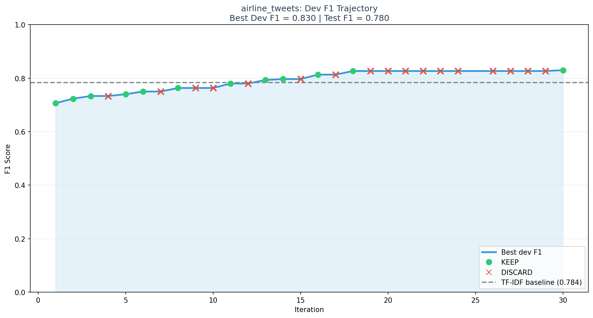
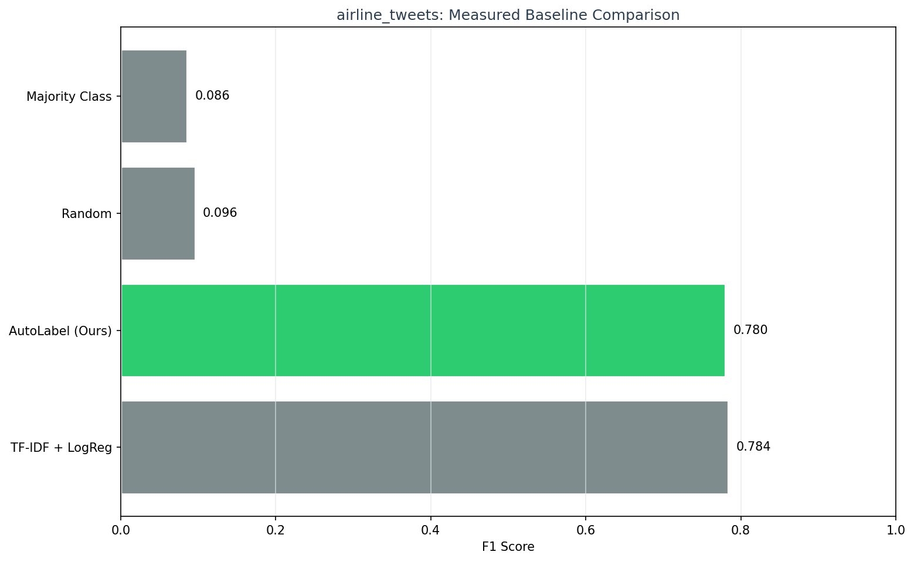
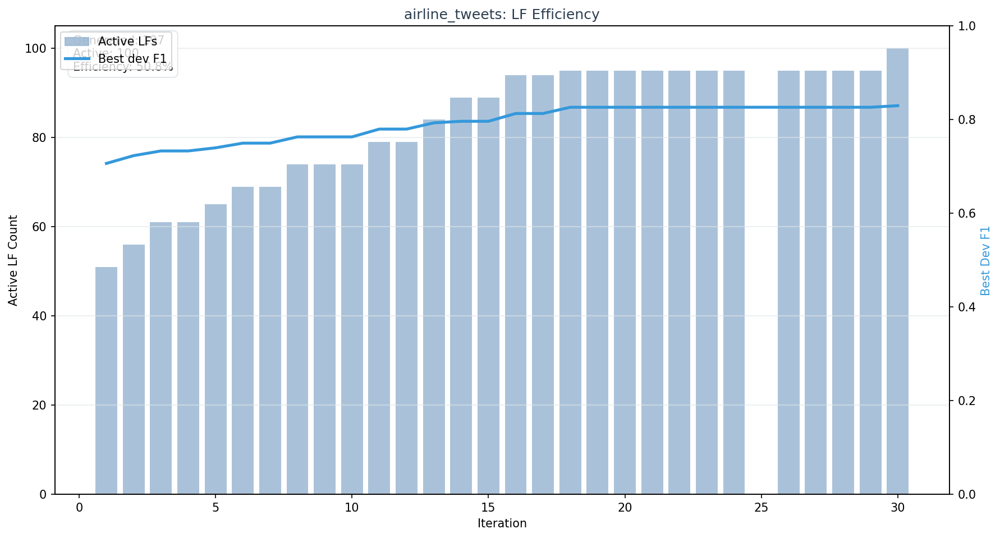

# AutoLabel

[](https://github.com/yashpatil582/autolabel/actions/workflows/ci.yml)
[](https://www.python.org/downloads/)
[](LICENSE)

**AutoLabel is an autonomous weak-supervision system that uses an LLM to generate, validate, and iteratively improve labeling functions.**

It turns LF authoring into a reproducible optimization loop with inspectable Python rules, a keep/discard ratchet, measured benchmark artifacts, and publication-style visualizations.

Project status: beta research system focused on automated LF authoring, reproducibility, and multilingual expansion.

## Why It Matters

- Weak supervision is powerful, but manual labeling-function authoring is slow and brittle.
- AutoLabel uses an LLM to propose new LFs, validates them in an AST sandbox, and only keeps changes that improve held-out dev F1.
- The output is still inspectable Python, not a black-box-only classifier.
- The current roadmap is India-first multilingual support: Hindi first, Marathi next, then broader regional language coverage.

## Measured Result

Measured on `airline_tweets` entity extraction with a 30-iteration autonomous run.

| Method | Test F1 | Setting |
|--------|---------|---------|
| Random baseline | 0.096 | Label-space random guess |
| Majority class | 0.086 | Predict most frequent train label |
| TF-IDF + LogReg | 0.784 | Supervised baseline trained on the labeled train split |
| **AutoLabel** (`llama-3.1-8b-instant`, 30 iters) | **0.780** | Autonomous LF generation + weak-supervision aggregation |

Committed proof artifacts:

- [Measured benchmark artifact](docs/proof/airline_tweets_benchmark_results.json)
- [Run summary](docs/proof/proof_v7_8b_mv_40iter_final_summary.json)
- [Run metadata](docs/proof/proof_v7_8b_mv_40iter_meta.json)

Current benchmark harness uses labeled train examples to seed LF generation, labeled dev examples for ratchet selection, and labeled test examples for final evaluation. The strongest current claim is automated LF authoring and iterative weak supervision, not zero-label superiority over supervised baselines.

## Proof

### F1 Trajectory



The keep/discard ratchet steadily raises best dev F1 across 40 iterations, ending at `0.683` dev F1 and `0.656` test F1.

### Measured Baseline Comparison



The benchmark chart is built from measured results only. It does not fabricate missing baselines or substitute expected values.

### LF Efficiency



The active LF set grows over time while the ratcheted F1 curve shows where the improvement actually came from.

## Reproduce This Result

```bash
# Install with dev + visualization extras
pip install -e ".[dev,viz]"

# Set an LLM provider key
export GROQ_API_KEY=gsk_...

# Reproduce the autonomous run
autolabel run \
  -d airline_tweets \
  -p groq \
  -m llama-3.1-8b-instant \
  -n 40 \
  --run-name proof_v7_8b_mv_40iter

# Evaluate the completed run
autolabel evaluate experiments/proof_v7_8b_mv_40iter

# Generate measured benchmark results
autolabel benchmark \
  -d airline_tweets \
  -p groq \
  -m llama-3.1-8b-instant \
  -n 40 \
  --llm-time-budget-minutes 10

# Render publication-style charts for the run
autolabel visualize \
  experiments/proof_v7_8b_mv_40iter \
  --benchmark-results experiments/benchmark/results.json
```

The benchmark timer is optional. Classical baselines always complete; zero-shot and few-shot LLM baselines can be budget-guarded on free tiers.

## How It Works

```text
1. Analyze held-out dev failures and per-label coverage
2. Ask the LLM to choose a strategy and target label
3. Generate candidate Python labeling functions
4. Validate them in an AST sandbox
5. Apply all LFs and aggregate predictions with a label model
6. Keep only candidates that improve dev F1
7. Repeat
```

Core ingredients:

- Autonomous improvement loop inspired by Karpathy-style ratcheting
- Weak supervision via labeling functions plus label-model aggregation
- Inspectable LLM-generated Python, not opaque prompting alone
- Headless-safe visualization CLI for proof artifacts

## Quick Start

```bash
pip install -e .
export GROQ_API_KEY=gsk_...

autolabel run -d airline_tweets -p groq -m llama-3.1-8b-instant -n 20
autolabel evaluate experiments/<run_dir>
```

Optional charting support:

```bash
pip install -e ".[viz]"
autolabel visualize experiments/<run_dir>
```

## Multilingual Direction

AutoLabel already includes Unicode-aware prompting and Hindi/Marathi dataset loaders. The public roadmap is to harden multilingual support in this order:

1. English + Hindi proof-quality workflows
2. Marathi expansion
3. Broader India-first regional language coverage

Example commands:

```bash
autolabel run -d hindi_headlines -p groq --language hi
autolabel run -d marathi_headlines -p groq --language mr
```

## Datasets and Provenance

AutoLabel supports one bundled quickstart dataset plus runtime-loaded HuggingFace datasets.

| Dataset | Language | Task | Access |
|---------|----------|------|--------|
| `airline_tweets` | English | Airline entity extraction | Bundled in this repository |
| `imdb` | English | Sentiment | Loaded from HuggingFace at runtime |
| `ag_news` | English | Topic classification | Loaded from HuggingFace at runtime |
| `yelp` | English | Star rating | Loaded from HuggingFace at runtime |
| `sms_spam` | English | Spam detection | Loaded from HuggingFace at runtime |
| `trec` | English | Question classification | Loaded from HuggingFace at runtime |
| `hindi_headlines` | Hindi | News classification | Loaded from HuggingFace at runtime |
| `marathi_headlines` | Marathi | News classification | Loaded from HuggingFace at runtime |

See [DATASETS.md](DATASETS.md) for provenance and redistribution notes.

## Architecture

```text
autolabel/
├── core/        autonomous loop, strategy selection, keep/discard ratchet
├── lf/          LF generation, sandbox, registry, applicator
├── label_model/ majority, weighted, generative EM
├── llm/         Anthropic, OpenAI, Groq, Ollama
├── data/        dataset abstraction and loaders
├── evaluation/  metrics and evaluator
├── benchmark/   baselines, reporting, visualization
└── logging/     experiment logs and Rich output
```

## Development

```bash
pip install -e ".[dev]"
pytest tests/ -v
ruff check autolabel/ tests/
ruff format --check autolabel/ tests/
```

## Cite and Contribute

- Citation metadata: [CITATION.cff](CITATION.cff)
- Contributing guide: [CONTRIBUTING.md](CONTRIBUTING.md)
- Code of conduct: [CODE_OF_CONDUCT.md](CODE_OF_CONDUCT.md)
- Security policy: [SECURITY.md](SECURITY.md)
- Release notes: [docs/releases/v1.0.0.md](docs/releases/v1.0.0.md)

## References

1. Karpathy, A. (2025). *autoresearch: AI agents running research automatically*. [GitHub](https://github.com/karpathy/autoresearch)
2. Ratner et al. (2016). *Data Programming: Creating Large Training Sets, Quickly*. NeurIPS.
3. Ratner et al. (2017). *Snorkel: Rapid Training Data Creation with Weak Supervision*. VLDB.
4. Zhang et al. (2024). *Leveraging LLMs for Structure Learning in Prompted Weak Supervision*. arXiv.
5. Huang et al. (2024). *LLM-assisted Labeling Function Generation*. VLDB Workshop.

## License

MIT
